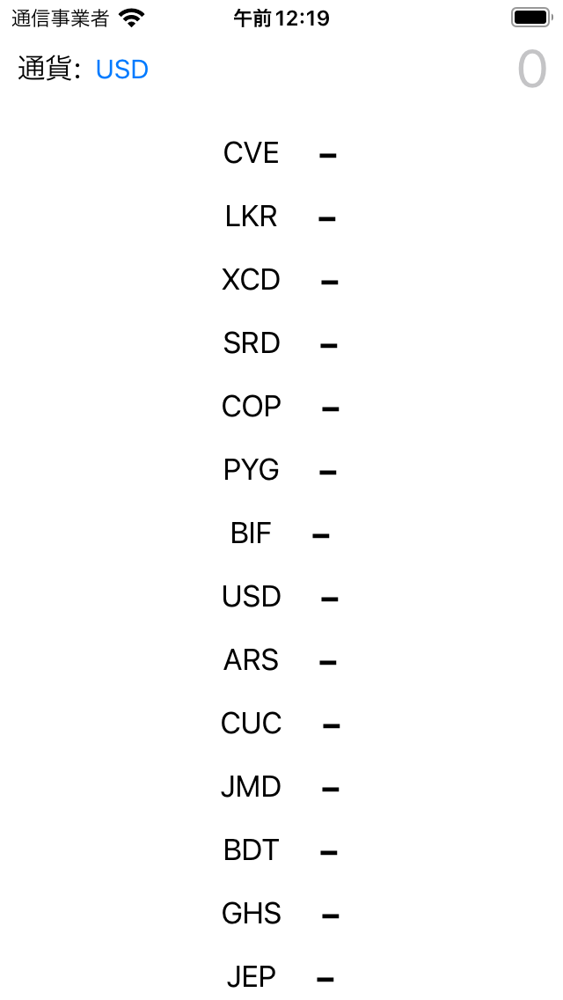

# Kawase（為替）Calculator

Kawase converter iOS application 

## Installation

Open KawaseCalculator.xcodeproj on Xcode & Run

## Environment
Xcode Version 13.3 (13E113)

iOS 15.4 Simulator and Device

swift-driver version: 1.45.2 

Apple Swift version 5.6 
## Dependency

Openexchangerates.org
- /api/latest.json

Swiftlint v0.49.1 (optional)

## Note

Clean architecture + MVVM

Felix Chon 
felixinkor@gmail.com
20221003

####
